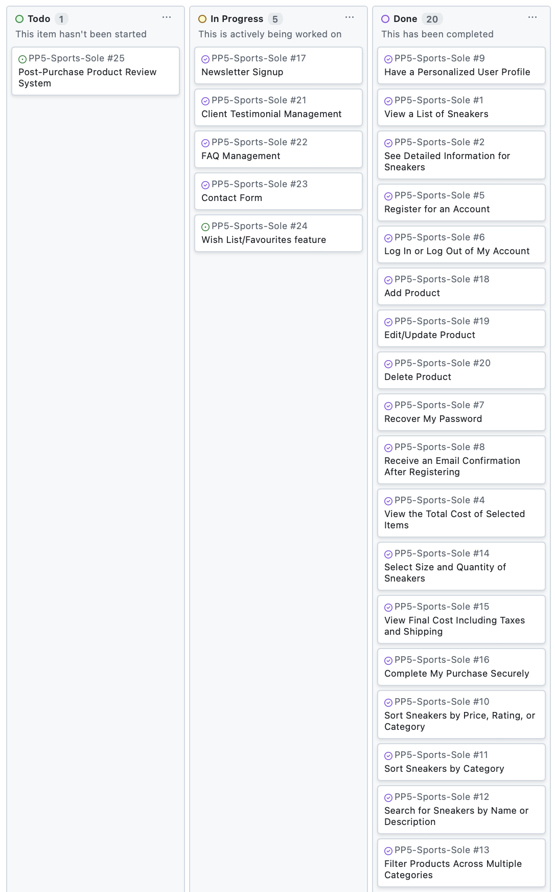

# Sports Sole

Sports Sole is your go-to online platform for high-quality sneakers designed to meet the needs of athletes, casual wearers, and sneaker enthusiasts alike. Whether you're searching for performance running shoes, stylish casual sneakers, or durable basketball shoes, Sports Sole offers a wide selection of top brands and the latest models. At Sports Sole, we’re committed to helping you find the perfect pair for every step.

Visit the deployed website [here](https://sports-sole-d03df7b3c157.herokuapp.com/).

## Table of Contents

1. [User Experience (UX)](#user-experience-ux)
    1. [Strategy](#strategy)
        1. [Project Goals](#project-goals)
        2. [User Stories](#user-stories)
        3. [Strategy Table](#strategy-table)
    2. [Scope](#scope)
        1. [Kanban Board](#kanban-board)
    3. [Structure](#structure)
        1. [Flowchart](#flowchart)
        3. [Database model](#database-model)
    4. [Skeleton](#skeleton)
        1. [Wireframe](#wireframe)
    5. [Surface](#surface)
        1. [Color Scheme](#color-scheme)
        2. [Typography](#typography)
2. [Features](#features)
    1. [General](#general)
    2. [Home Page](#home-page)
    3. [About Page](#about-page)
    4. [Treatments](#treatments)
    5. [My Appointments](#my-appointments)
    6. [Error Handling](#user-profile)
    7. [Authentication Pages](#authentication-pages)
3. [Technologies Used](#technologies-used)
    1. [Languages Used](#languages-used)
    2. [Libraries and Frameworks](#libraries-and-frameworks)
    3. [Packages / Dependencies Installed](#packages--dependencies-installed)
    4. [Database Management](#database-management)
    5. [Tools and Programs](#tools-and-programs)
4. [Testing](#testing)
    1. [Go to TESTING.md](https://github.com/Alvor1991/PP4-SportsTherapy/blob/main/TESTING.md)
5. [Deployment](#deployment)
6. [Finished Product](#finished-product)
7. [Credits](#credits)
8. [Known Bugs](#known-bugs)
9. [Acknowledgements](#acknowledgements)

***

## User Experience (UX)

### Strategy

#### Site Owner Goals

- Provide a professional and trustworthy e-commerce platform.
- Build and maintain a loyal customer base.
- Efficiently manage product inventory.
- Drive sales through effective product presentation.
- Gather customer data through newsletter signups.

#### Business Model

The site operates on a B2C model where:
- Products are sold directly to end consumers.
- Customer accounts allow for personalized shopping experiences.
- Direct marketing through newsletter subscriptions.
- Customer engagement through testimonials and FAQs.

#### Target Audience

- Sports enthusiasts looking for quality footwear.
- Casual shoppers seeking athletic shoes.
- Customers interested in both performance and style.
- People looking for specific types of sports shoes (running, basketball, etc.)

#### Marketing Strategy

1. ##### Email Marketing
   - Newsletter subscription feature to build customer database
   - Keep customers informed about new products and offers

2. ##### Customer Engagement
   - Customer testimonials to build trust
   - FAQ section to provide immediate answers to common queries
   - Contact form for customer support

3. ##### User Experience
   - Easy navigation through product categories
   - Detailed product information and images
   - Secure user accounts and checkout process
   - Order history and profile management
   - Wish list for favourite products 

#### User Stories

##### Shopper Stories:
1. View a List of Sneakers
2. See Detailed Information for Sneakers
3. Quickly Identify Deals and Discounts
4. View the Total Cost of Selected Items
5. Register for an Account
6. Log In or Log Out of My Account
7. Recover My Password
8. Receive an Email Confirmation After Registering
9. Have a Personalized User Profile
10. Sort Sneakers by Price, Rating, or Category
11. Sort Sneakers by Category
12. Search for Sneakers by Name or Description
13. Filter Products Across Multiple Categories
14. Select Size and Quantity of Sneakers
15. View Final Cost Including Taxes and Shipping
16. Complete My Purchase Securely
17. Newsletter Signup
23. Contact Form
24. Wishlist/Favorites Feature
25. Post-Purchase Product Review System
26. View and Purchase Discounted Products

##### Admin Stories:
18. Add Product
19. Edit/Update Product
20. Delete Product
21. Client Testimonial Management
22. FAQ Management

#### Kanban board

**Sprint 1 - Basic Product Viewing and User**


**Sprint 2 - Product Management and User Profiles**  


**Sprint 3 - Shopping Bag and Checkout Process**  


**Sprint 4 - Checkout Process**  


**Sprint 5 - Sorting, Searching, and Additional Features**  



**Sprint 6 - Marketing Features and Final Polishing**  


### Structure

#### Flowchart

The website is organized using a [Mermaid](https://mermaid.js.org/) Flowchart to illustrate the user journey and interactions, ensuring intuitive navigation and a seamless user experience. The chart outlines the interactions available to both logged-in and logged-out users, illustrating how they navigate through the site's features.


##### User Flow

#### Database Model

The database model was designed using [drawsql](https://drawsql.app/) and is managed with [PostgreSQL](https://www.postgresql.org/), a relational database.


### Skeleton

#### Wireframes

[Balsamiq](https://balsamiq.com/) was used to create a layout of the website in the planning phase. Here are my initial designs: 

Page | Desktop Version | Mobile Version
--- | --- | ---
Login |  | 
Sign Up |  | 
Home |  | 
Products |  | 
Product Detail |  | 
Bag |  | 
Checkout |  | 
My profile |  | 
Admin Add Product |  | 

## Agile Development Plan

### Epics and User Stories

| Epic ID | Epic Name | User Stories |
|---------|-----------|--------------|
| E1 | Viewing and Navigation | 1. View a List of Sneakers (#1)<br>2. See Detailed Information for Sneakers (#2)<br>3. Quickly Identify Deals and Discounts (#3)<br>4. View the Total Cost of Selected Items (#4)<br>26. View and Purchase Discounted Products (#26) |
| E2 | Registration and User Accounts | 5. Register for an Account (#5)<br>6. Log In or Log Out of My Account (#6)<br>7. Recover My Password (#7)<br>8. Receive an Email Confirmation After Registering (#8)<br>9. Have a Personalized User Profile (#9)<br>24. Wishlist/Favorites feature (#24) |
| E3 | Sorting and Searching | 10. Sort Sneakers by Price, Rating, or Category (#10)<br>11. Sort Sneakers by Category (#11)<br>12. Search for Sneakers by Name or Description (#12)<br>13. Filter Products Across Multiple Categories (#13) |
| E4 | Purchasing and Checkout | 14. Select Size and Quantity of Sneakers (#14)<br>15. View Final Cost Including Taxes and Shipping (#15)<br>16. Complete My Purchase Securely (#16) |
| E5 | Marketing and Customer Engagement | 17. Newsletter Signup (#17)<br>18. Client Testimonial Management (#21)<br>19. FAQ Management (#22)<br>20. Contact Form (#23) |
| E6 | Admin and Store Management | 21. Add Product (#18)<br>22. Edit/Update Product (#19)<br>23. Delete Product (#20) |
| E7 | Future Enhancements | 25. Post-Purchase Product Review System (#25) |


### MoSCoW Prioritization

| Priority | User Stories |
|-------------|-------------------------------------------------------------------------------------------------------|
| Must Have | 1. View a List of Sneakers (#1)<br>2. See Detailed Information for Sneakers (#2)<br>3. Register for an Account (#5)<br>4. Log In or Log Out of My Account (#6)<br>5. Select Size and Quantity of Sneakers (#14)<br>6. Complete My Purchase Securely (#16)<br>7. Add Product (#18)<br>8. Edit/Update Product (#19)<br>9. Delete Product (#20) |
| Should Have | 1. View the Total Cost of Selected Items (#4)<br>2. Recover My Password (#7)<br>3. Receive an Email Confirmation After Registering (#8)<br>4. Have a Personalized User Profile (#9)<br>5. Search for Sneakers by Name or Description (#12)<br>6. View Final Cost Including Taxes and Shipping (#15) |
| Could Have | 1. Quickly Identify Deals and Discounts (#3)<br>2. Sort Sneakers by Price, Rating, or Category (#10)<br>3. Sort Sneakers by Category (#11)<br>4. Filter Products Across Multiple Categories (#13)<br>5. Newsletter Signup (#17)<br>6. Client Testimonial Management (#21)<br>7. FAQ Management (#22)<br>8. Contact Form (#23)<br>9. Wishlist/Favorites feature (#24)<br>10. View and Purchase Discounted Products (#26) |
| Won't Have | 1. Post-Purchase Product Review System (#25) |

### Sprint Planning

| Sprint     | Duration   | User Stories                        | Milestone                                               |
|------------|------------|-------------------------------------|---------------------------------------------------------|
| Sprint 1   | 2 weeks    | #1, #2, #5, #6                      | Basic product catalog and user account functionality     |
| Sprint 2   | 2 weeks    | #18, #19, #20, #7, #8, #9           | Admin product management and enhanced user account features |
| Sprint 3   | 2 weeks    | #4, #14, #15                        | Functional shopping bag and initial checkout process     |
| Sprint 4   | 2 weeks    | #16                                 | Secure checkout process completion                      |
| Sprint 5   | 2 weeks | #10, #11, #12, #13, #3, #26            | Implemented search, sorting, and special offers features |
| Sprint 6   | 2 weeks    | #17, #21, #22, #23, #24             | Implement marketing features, wishlist functionality, bug fixes, and final testing |

### Difficulty Level (Fibonacci sequence)

**Story Point Key:**
- 1 = Low complexity (Simple features, basic CRUD operations, straightforward implementations)
- 3 = Medium complexity (Multiple components, integrations, moderate functionality)
- 5 = High complexity (Security features, complex integrations, significant development effort)

**Story Points Scale:**
| Points | Complexity | Description |
|--------|------------|-------------|
| 1 | Low | Simple features, basic CRUD operations, straightforward implementations |
| 3 | Medium | Multiple components, integrations, moderate functionality |
| 5 | High | Security features, complex integrations, significant development effort |

**##### Shopper Stories:**
1. View a List of Sneakers - Basic product display functionality (1)
2. See Detailed Information for Sneakers - Multiple data points and image handling (3)
3. Quickly Identify Deals and Discounts - Clear display of special offers (3)
4. View the Total Cost of Selected Items - Basic calculation and display (1)
5. Register for an Account - Form validation and database integration (3)
6. Log In or Log Out of My Account - Standard authentication functionality (1)
7. Recover My Password - Email integration and security measures (3)
8. Receive an Email Confirmation After Registering - Email service integration (3)
9. Have a Personalized User Profile - User data management and display (5)
10. Sort Sneakers by Price, Rating, or Category - Multiple sorting algorithms (3)
11. Sort Sneakers by Category - Basic filtering functionality (1)
12. Search for Sneakers by Name or Description - Complex search functionality (5)
13. Filter Products Across Multiple Categories - Multiple filter combinations (3)
14. Select Size and Quantity of Sneakers - Basic product selection features (1)
15. View Final Cost Including Taxes and Shipping - Multiple calculations required (3)
16. Complete My Purchase Securely - Payment integration and security (5)
17. Newsletter Signup - Simple form and email list management (1)
23. Contact Form - Basic form functionality (1)
24. Wishlist/Favorites Feature - User-specific data management (5)
25. Post-Purchase Product Review System - Complex review system integration (5)
26. View and Purchase Discounted Products - Price calculations and display logic (3)

**##### Admin Stories:**
18. Add Product - Complex form with image handling (5)
19. Edit/Update Product - Similar complexity to adding products (5)
20. Delete Product - Basic deletion with confirmation (1)
21. Client Testimonial Management - Content management functionality (3)
22. FAQ Management - Basic content management system (3)


#### Sports Sole User Flow Chart

## Persistent Elements (Available on All Pages)

### Header
- Logo (links to Home)
- Search Bar
- My Account Dropdown
  - For non-authenticated users:
    -> Register
    -> Login
  - For authenticated users:
    -> My Profile
    -> Logout
  - For superusers:
    -> Product Management
- Shopping Bag (with total amount)
- Free Delivery Threshold Banner

### Main Navigation
- Home
- All Products
  -> By Price
  -> By Rating
  -> By Category
  -> All Products
- Women's
  -> Running Shoes
  -> Training and Gym Shoes
  -> Basketball Shoes
  -> Casual Sneakers
  -> All Women's Sneakers
- Men's
  -> Running Shoes
  -> Training and Gym Shoes
  -> Basketball Shoes
  -> Casual Sneakers
  -> All Men's Sneakers
- Special Offers
  -> New Arrivals
  -> Clearance

### Footer
- Quick Links (Home, Shop,)
- Customer Service (Contact, FAQ)
- Social Media Links
- Newsletter Signup

## Page-Specific Flows

### 1. Home Page (index.html)
- Hero Section with "Shop Now" CTA
- New Arrivals Section
- Customer Testimonials
- Newsletter Signup Form
- Contact Form
- FAQ Section

### 2. Products Page (products.html)
- Product Listing with Filtering and Sorting Options
- Category Badges
- Pagination (if implemented)
- For superusers: Edit/Delete product options

### 3. Product Detail Page (product_detail.html)
- Product Image (with zoom option if implemented)
- Product Information (name, price, category, rating)
- Size Selection
- Quantity Selection
- Add to Bag functionality
- For superusers: Edit/Delete product options

### 4. Shopping Bag Page (bag.html)
- List of Items in Bag
- Update Quantity functionality
- Remove Item functionality
- Subtotal for each item
- Order Total, Delivery Cost, Grand Total
- "Keep Shopping" and "Secure Checkout" options

### 5. Checkout Page (checkout.html)
- Order Summary
- Delivery Information Form
- Payment Information (Stripe integration)
- Option to save delivery info to profile (for authenticated users)
- Complete Order functionality

### 6. Checkout Success Page
- Order confirmation details
- Order history

### 7. Profile Page (profile.html)
- Default Delivery Information Form
- Order History Table

### 8. Product Management (for superusers)
- Add Product Form
- Edit Product Form

## User Interactions
- Receive and view toast messages for various actions
- Use of "Back to Top" button on longer pages
- Responsive design elements (e.g., collapsible navigation on mobile)

## Authentication Flows
- Registration Process
- Login Process
- Password Recovery Process

This comprehensive flow chart now accurately represents the full user experience on your Django Sports Sole website, incorporating all the elements from your provided templates and accounting for various user types and interactions.

### Business Model

#### Company description

NoPlast is a B2C company that offer our customers plastic- free alternatives to plastic products in order to help us in our mission, to reduce the plastic consumption. Additionally, we provide information to create consciousness about plastic pollution and help our customers to take active choices in order to reduce their plastic waste.

#### Customers

Our thought costumers are millennials and younger, singles and families who have an environmental interest and a will to reduce their plastic consumption.

#### Competitors

We see that we have three types of competitors. 
There are companies that have the same interest and vision as NoPlast. But they are mainly focusing on a smaller range of products, such as baby products, hygiene and makeup, or kitchen products, while we have a wider range of products (Lilla Lammet, Less Plastic, Ecco-Verde, etc.).
The other type of competitors that are bigger and have all kinds of products, but they supply both environmental and plastic products and it is therefore not as easy to get a good overview and get inspired of new plastic free products, and environmental tips at the same place. (Åhlens, IKEA etc.).
There are some companies that offer the same kind of range as we do (Be Plast Free and Rekoshoppen). But they are not on the informative aspect to solve the plastic waste problem.

#### SWOT analysis

### Strengths
- Wide range of sports shoes catering to different activities (running, basketball, training)
- User-friendly e-commerce platform with robust search and filtering
- Secure payment processing system
- Personalized user accounts with wishlist functionality
- Clear product categorization (Men's/Women's)
- Detailed product information and imagery
- Newsletter subscription for customer engagement
- Responsive design accessible on all devices

### Weaknesses
- New brand in a competitive market
- Limited product range (only footwear)
- No physical store presence
- Limited customer reviews and ratings
- No loyalty program currently implemented
- Dependency on third-party payment systems
- Limited social proof as a new business

### Opportunities
- Growing market for athletic footwear
- Increasing trend in fitness and sports activities
- Potential for expansion into related products
- Social media marketing potential
- Seasonal sales and promotions
- Customer data collection through newsletter signups
- Integration of customer reviews system
- Mobile commerce growth

### Threats
- Established competitors (Nike, Adidas, etc.)
- Economic fluctuations affecting consumer spending
- Changing fashion trends
- Supply chain dependencies
- Price competition from larger retailers
- Cybersecurity risks
- Changes in e-commerce regulations

**Marketing Strategy**

Due to our small marketing budget, we have decided to start a Facebook Business page and interact with our customers and bigger organizations within the environmentally friendly branch through that marketing channel. For our buying customers we have made it easy to sign up for our newsletter, in order to make them even more loyal and facilitate for them to share tips and products with their friends and family. Now, in this stage of starting a new company we rely a lot on “word of mouth” and that cooperation’s with organizations and influencers to bring value to the company by attracting more visitors for our homepage and more buying customers.

**Facebook Business page**

See the live Facebook Business page [here](https://www.facebook.com/profile.php?id=61567026901922).


Page | Desktop | Mobile |
--- | --- | --- |
| Nav Bar |  |  |
| Home |  |  |
| About |  |  |
| Book Appointment |  |  |
| User Appointments |  |  |
| Update Appointment |  |  |
| Delete Appointment |  |  |
| Sign Up |  |  |
| Sign In |  |  |
| 404 Error |  |  |

## Technologies Used

### Languages Used

* [HTML5](https://en.wikipedia.org/wiki/HTML)
* [CSS3](https://en.wikipedia.org/wiki/CSS)
* [JavaScript](https://en.wikipedia.org/wiki/JavaScript)
* [Python](https://en.wikipedia.org/wiki/Python_(programming_language))

### Libraries and Frameworks

* [Django](https://www.djangoproject.com/) - was used as web framework.
* [Django Template](https://docs.djangoproject.com/en/5.1/topics/templates/) - was used as a templating language for Django to display backend data to HTML.
* [Bootstrap 5](https://getbootstrap.com/docs/5.0/getting-started/introduction/) - was used to help with styling and responsiveness.
* [Google Fonts](https://fonts.google.com) - was used to import the fonts into the HTML file.
* [Font Awesome](https://fontawesome.com) - was used throughout the website to add icons for aesthetic and UX purposes.

### Packages / Dependencies Installed

* [Django Allauth](https://docs.allauth.org/en/latest/) - used for user authentication, registration, and account management.
* [Django Crispy Form](https://django-crispy-forms.readthedocs.io/en/latest/) - used to control the rendering of the forms.
* [Gunicorn](https://gunicorn.org/) - a Python WSGI HTTP Server for UNIX.
* [Pillow](https://python-pillow.org/) - was used to add image processing capabilities.
* [Django Countries](https://pypi.org/project/django-countries/) - provides country choices for forms.
* [Django Taggit](https://django-taggit.readthedocs.io/en/latest/) - a simple tagging library for Django.
* [Psycopg2](https://www.psycopg.org) - a PostgreSQL adapter for the Python programming language.
* [Whitenoise](https://whitenoise.readthedocs.io/en/stable/django.html) - a middleware for serving static files.

### Payment Service

* [Stripe](https://stripe.com/en-nl) - was used to process all online payments transactions.

### Cloud Storage

* [Cloudinary](https://cloudinary.com/) - used as an image management solution.

### Database Management

* [SQLite](https://www.sqlite.com/index.html) - was used as a single-file database during development.

* [Heroku Postgres](https://www.heroku.com/postgres) - was used in production, as a service based on PostgreSQL provided by Heroku.

[Back to top ⇧](#sports-therapy)

### Tools and Programs

* [GitPod](https://gitpod.io/) - used for writing code, committing, and then pushing to GitHub.
* [GitHub](https://github.com) - used to store the project's code after being pushed from Git.
* [Heroku](https://www.heroku.com) - used to deploy the website.
* [Am I Responsive](ami.responsivedesign.is) - used to preview the website across a variety of popular devices.
* [Coolors](https://coolors.co) - was used to create a color scheme for the website.
* [Balsamiq](https://balsamiq.com/) - was used to create the wireframes during the design phase of the project.
* [Chrome DevTools](https://developer.chrome.com/docs/devtools/) - used during development process for code review and to test responsiveness.
* [W3C Markup Validator](https://validator.w3.org/) - used to validate the HTML code.
* [W3C CSS Validator](https://jigsaw.w3.org/css-validator/) - used to validate the CSS code.
* [JSHint](https://jshint.com/) - used to validate the site's JavaScript code.
* [PEP8CI](https://pep8ci.herokuapp.com/) - used to validate the Python code.
* [Favicon.cc](https://www.favicon.cc/) - used to create the site favicon.

## Testing

The testing documentation can be found [here](https://github.com/Alvor1991/PP4-SportsTherapy/blob/main/TESTING.md).

[Back to top ⇧](#sports-therapy)

## Deployment

Project developed using a [GitPod](https://gitpod.io/) workspace. The code was committed to [Git](https://git-scm.com/) and pushed to [GitHub](https://github.com/").

### Deploying on Heroku
To deploy this page to Heroku from its GitHub repository, the following steps were taken:

1. Create the Heroku App:
    - Select "Create new app" in Heroku.
    - Choose a name for your app and select the location.

2. Attach the Postgres database:
    - In the Resources tab, under add-ons, type in Postgres and select the Heroku Postgres option.

3. Prepare the environment and settings.py file:
    * In the Settings tab, click on Reveal Config Vars and copy the url next to DATABASE_URL.
    * In your GitPod workspace, create an env.py file in the main directory. 
    * Add the DATABASE_URL value and your chosen SECRET_KEY value to the env.py file.
    * Add the SECRET_KEY value to the Config Vars in Heroku.
    * Update the settings.py file to import the env file and add the SECRETKEY and DATABASE_URL file paths.
    * Update the Config Vars with the Cloudinary url, adding into the settings.py file also.
    * In settings.py add the following sections:
        * Cloudinary to the INSTALLED_APPS list
        * STATICFILE_STORAGE
        * STATICFILES_DIRS
        * STATIC_ROOT
        * MEDIA_URL
        * DEFAULT_FILE_STORAGE
        * TEMPLATES_DIR
        * Update DIRS in TEMPLATES with TEMPLATES_DIR
        * Update ALLOWED_HOSTS with ['app_name.heroku.com', 'localhost']

4. Store Static and Media files in Cloudinary and Deploy to Heroku:
    - Create three directories in the main directory; media, storage and templates.
    - Create a file named "Procfile" in the main directory and add the following:
        - web: gunicorn project-name.wsgi
    - Go to Deploy tab on Heroku and connect to the GitHub, then to the required repository.
    Click on Delpoy Branch and wait for the build to load. When the build is complete, the app can be opened through Heroku.

### Forking the Repository
By forking the GitHub Repository we make a copy of the original repository on our GitHub account to view and/or make changes without affecting the original repository by using the following steps...

1. Log into [GitHub](https://github.com/login) or [create an account](https://github.com/join).
2. Locate the [GitHub Repository](https://github.com/Alvor1991/PP4-SportsTherapy).
3. At the top of the repository, on the right side of the page, select "Fork"
4. You should now have a copy of the original repository in your GitHub account.

### Creating a Clone
How to run this project locally:
1. Install the [GitPod Browser](https://www.gitpod.io/docs/browser-extension/ "Link to Gitpod Browser extension download") Extension for Chrome.
2. After installation, restart the browser.
3. Log into [GitHub](https://github.com/login "Link to GitHub login page") or [create an account](https://github.com/join "Link to GitHub create account page").
2. Locate the [GitHub Repository](https://github.com/Alvor1991/PP4-SportsTherapy).
5. Click the green "GitPod" button in the top right corner of the repository.
This will trigger a new gitPod workspace to be created from the code in github where you can work locally.

How to run this project within a local IDE, such as VSCode:

1. Log into [GitHub](https://github.com/login) or [create an account](https://github.com/join).
2. Locate the [GitHub Repository](https://github.com/Alvor1991/PP4-SportsTherapy).
3. Under the repository name, click "Clone or download".
4. In the Clone with HTTPs section, copy the clone URL for the repository.
5. In your local IDE open the terminal.
6. Change the current working directory to the location where you want the cloned directory to be made.
7. Type 'git clone', and then paste the URL you copied in Step 3.
```
git clone https://github.com/Alvor1991/PP4-SportsTherapy
```
8. Press Enter. Your local clone will be created.

Further reading and troubleshooting on cloning a repository from GitHub [here](https://docs.github.com/en/free-pro-team@latest/github/creating-cloning-and-archiving-repositories/cloning-a-repository)


[Back to top ⇧](#sports-therapy)