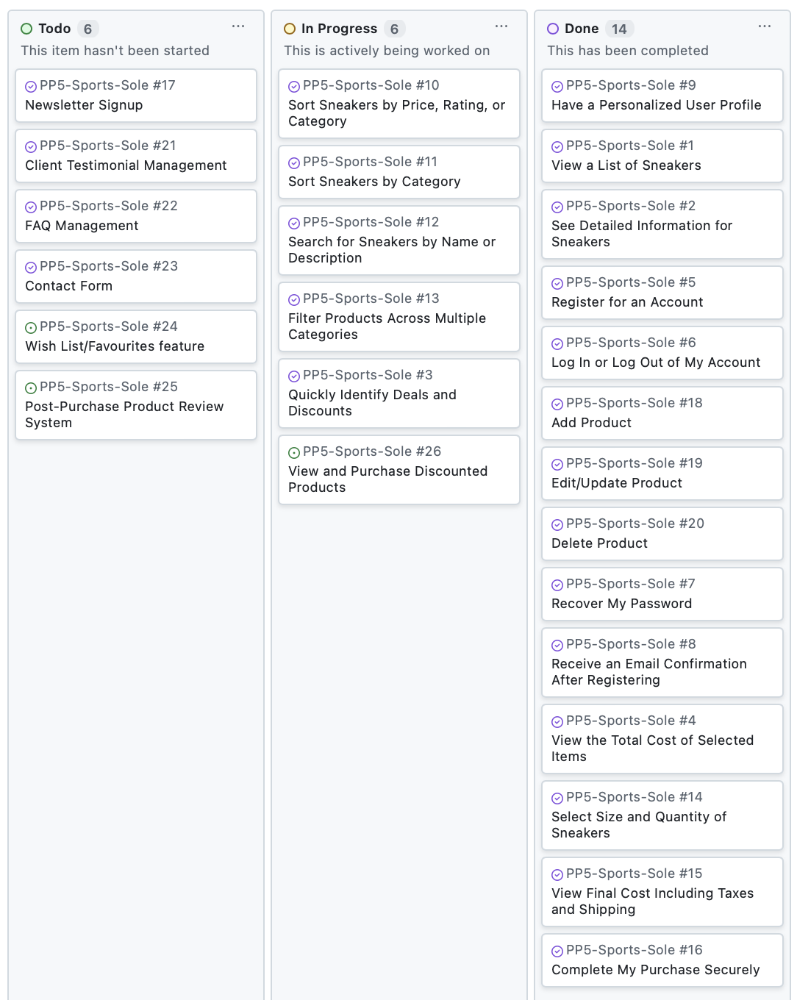
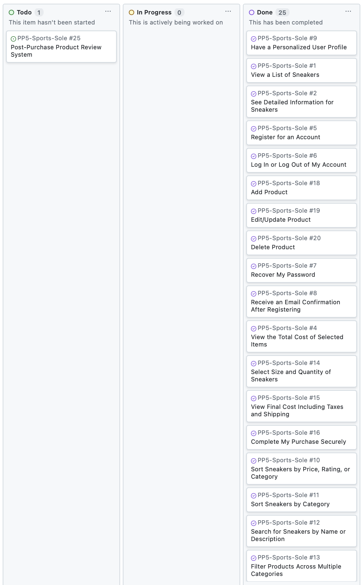
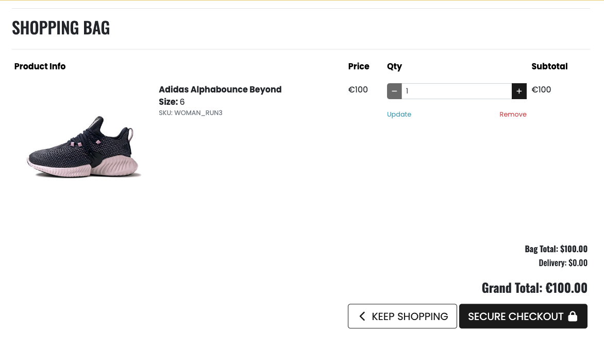

# Sports Sole

Sports Sole is your go-to online platform for high-quality sneakers designed to meet the needs of athletes, casual wearers, and sneaker enthusiasts alike. Whether you're searching for performance running shoes, stylish casual sneakers, or durable basketball shoes, Sports Sole offers a wide selection of top brands and the latest models. At Sports Sole, we’re committed to helping you find the perfect pair for every step.


Visit the deployed website [here](https://sports-sole-d03df7b3c157.herokuapp.com/).

## Table of Contents

1. [User Experience (UX)](#user-experience-ux)
    1. [Strategy](#strategy)
        1. [Project Goals](#project-goals)
        2. [User Stories](#user-stories)
    3. [Structure](#structure)
        1. [Flowchart](#flowchart)
        2. [Database model](#database-model)
    4. [Skeleton](#skeleton)
        1. [Wireframe](#wireframe)
2. [Agile Development Plan](#agile-development-plan)
    1. [Epics and User Stories](#epics-and-user-stories)
    2. [MoSCoW Prioritization and User Stories](#moscow-prioritization-and-user-stories)
    3. [Difficulty Level and User Stories](#difficulty-level-and-user-stories)
    4. [Sprint Planning and User Stories](#sprint-planning-and-user-stories)
    5. [Kanban board](#kanban-board)
3. [Surface](#surface)
    1. [Colour Scheme](#colour-scheme)
    2. [Typography](#typography)
    3. [Background Design](#background-design)
4. [Marketing](#marketing)
    1. [Marketing Strategy](#marketing-strategy)
    2. [Business Model](#business-model)
        1. [Target Audience](#target-audience)
        2. [SWOT Analysis](#swot-analysis)
    3. [Seach Engine Optimization](#search-engine-optimization)
5. [Technologies Used](#technologies-used)
    1. [Languages Used](#languages-used)
    2. [Libraries and Frameworks](#libraries-and-frameworks)
    3. [Packages/Dependencies Installed](#packages--dependencies-installed)
    4. [Payment Service](#payment-service)
    5. [Cloud Storage](#cloud-storage)
    6. [Database Management](#database-management)
    7. [Tools and Programs](#tools-and-programs)
6. [Testing](#testing)
    1. [Go to TESTING.md](https://github.com/Alvor1991/PP5-Sports-Sole/blob/main/TESTING.md)
7. [Deployment](#deployment)
8. [Finished Product](#finished-product)
9. [Credits](#credits)
10. [Known Bugs](#known-bugs)
11. [Acknowledgements](#acknowledgements)

***

## User Experience (UX)

### Strategy

#### Project Goals

- Provide a professional and trustworthy e-commerce platform.
- Build and maintain a loyal customer base.
- Efficiently manage product inventory.
- Drive sales through effective product presentation.
- Gather customer data through newsletter signups.

#### User Stories

##### Shopper Stories:
1. View a List of Sneakers
2. See Detailed Information for Sneakers
3. Quickly Identify Deals and Discounts
4. View the Total Cost of Selected Items
5. Register for an Account
6. Log In or Log Out of My Account
7. Recover My Password
8. Receive an Email Confirmation After Registering
9. Have a Personalized User Profile
10. Sort Sneakers by Price, Rating, or Category
11. Sort Sneakers by Category
12. Search for Sneakers by Name or Description
13. Filter Products Across Multiple Categories
14. Select Size and Quantity of Sneakers
15. View Final Cost Including Taxes and Shipping
16. Complete My Purchase Securely
17. Newsletter Signup
23. Contact Form
24. Wishlist/Favorites Feature
25. Post-Purchase Product Review System
26. View and Purchase Discounted Products

##### Admin Stories:
18. Add Product
19. Edit/Update Product
20. Delete Product
21. Client Testimonial Management
22. FAQ Management

### Structure

#### Database Model

The database model was designed using [drawsql](https://drawsql.app/) and is managed with [PostgreSQL](https://www.postgresql.org/), a relational database.


The data models for this project are based on a walkthrough but have been significantly extended to meet the unique requirements of Sports Sole. Below is a summary of the key changes made to each model:

##### Checkout Models
In the `OrderLineItem` model, logic was added to calculate the `lineitem_total` using the discounted price when available, ensuring accurate handling of discounts. The use of the `Decimal` class improves precision in price calculations. The `Order` model remains similar but integrates seamlessly with this updated discount logic.

##### Products Model
A `Size` model and a many-to-many relationship with `Product` were introduced, allowing multiple sizes per product. This replaces the walkthrough's `has_sizes` field for greater flexibility. The `Product` model now includes a `discounted_price` field for managing price reductions, a `gender` field for product categorization, and uses `CloudinaryField` for efficient media storage. Additionally, the `TaggableManager` enhances search and organization capabilities by allowing product tagging.

##### Profile Models 
A new `Wishlist` model was introduced, enabling users to save products for future reference. It tracks which user added the product and when. The core `UserProfile` model is retained with minimal changes, ensuring smooth management of user-specific delivery information.

##### Home Models
The `NewsletterSubscriber`, `CustomerTestimonial`, `FAQ`, and `ContactSubmission` models help manage dynamic content on the website, such as testimonials, FAQs, newsletter subscriptions, and contact form submissions. These models enhance customer interaction and admin efficiency.

### Skeleton

#### Wireframes

[Balsamiq](https://balsamiq.com/) was used to create a layout of the website in the planning phase. Here are my initial designs: 

Page | Desktop Version | Mobile Version
--- | --- | ---
Login |  | 
Sign Up |  | 
Home |  | 
Products |  | 
Product Detail |  | 
Bag |  | 
Checkout |  | 
My profile |  | 
Admin Add Product |  | 

[Back to top ⇧](#sports-sole)

## Agile Development Plan

### Epics and User Stories

| Epic ID | Epic Name | User Stories |
|---------|-----------|--------------|
| E1 | Viewing and Navigation | 1. View a List of Sneakers (#1)<br>2. See Detailed Information for Sneakers (#2)<br>3. Quickly Identify Deals and Discounts (#3)<br>4. View the Total Cost of Selected Items (#4)<br>26. View and Purchase Discounted Products (#26) |
| E2 | Registration and User Accounts | 5. Register for an Account (#5)<br>6. Log In or Log Out of My Account (#6)<br>7. Recover My Password (#7)<br>8. Receive an Email Confirmation After Registering (#8)<br>9. Have a Personalized User Profile (#9)<br>24. Wishlist/Favorites feature (#24) |
| E3 | Sorting and Searching | 10. Sort Sneakers by Price, Rating, or Category (#10)<br>11. Sort Sneakers by Category (#11)<br>12. Search for Sneakers by Name or Description (#12)<br>13. Filter Products Across Multiple Categories (#13) |
| E4 | Purchasing and Checkout | 14. Select Size and Quantity of Sneakers (#14)<br>15. View Final Cost Including Taxes and Shipping (#15)<br>16. Complete My Purchase Securely (#16) |
| E5 | Marketing and Customer Engagement | 17. Newsletter Signup (#17)<br>18. Client Testimonial Management (#21)<br>19. FAQ Management (#22)<br>20. Contact Form (#23) |
| E6 | Admin and Store Management | 21. Add Product (#18)<br>22. Edit/Update Product (#19)<br>23. Delete Product (#20) |
| E7 | Future Enhancements | 25. Post-Purchase Product Review System (#25) |

### MoSCoW Prioritization and User Stories

| Priority | User Stories |
|-------------|-------------------------------------------------------------------------------------------------------|
| Must Have | 1. View a List of Sneakers (#1)<br>2. See Detailed Information for Sneakers (#2)<br>3. Register for an Account (#5)<br>4. Log In or Log Out of My Account (#6)<br>5. Select Size and Quantity of Sneakers (#14)<br>6. Complete My Purchase Securely (#16)<br>7. Add Product (#18)<br>8. Edit/Update Product (#19)<br>9. Delete Product (#20) |
| Should Have | 1. View the Total Cost of Selected Items (#4)<br>2. Recover My Password (#7)<br>3. Receive an Email Confirmation After Registering (#8)<br>4. Have a Personalized User Profile (#9)<br>5. Search for Sneakers by Name or Description (#12)<br>6. View Final Cost Including Taxes and Shipping (#15) |
| Could Have | 1. Quickly Identify Deals and Discounts (#3)<br>2. Sort Sneakers by Price, Rating, or Category (#10)<br>3. Sort Sneakers by Category (#11)<br>4. Filter Products Across Multiple Categories (#13)<br>5. Newsletter Signup (#17)<br>6. Client Testimonial Management (#21)<br>7. FAQ Management (#22)<br>8. Contact Form (#23)<br>9. Wishlist/Favorites feature (#24)<br>10. View and Purchase Discounted Products (#26) |
| Won't Have | 1. Post-Purchase Product Review System (#25) |

### Difficulty Level and User Stories

**Fibonacci sequence Key:**
- 1 = Low complexity (Simple features, basic CRUD operations, straightforward implementations)
- 3 = Medium complexity (Multiple components, integrations, moderate functionality)
- 5 = High complexity (Security features, complex integrations, significant development effort)

| Complexity | User Story |
|------------|------------|
| 1 | #1 View a List of Sneakers - Basic product display functionality |
| 1 | #4 View the Total Cost of Selected Items - Basic calculation and display |
| 1 | #6 Log In or Log Out of My Account - Standard authentication functionality |
| 1 | #11 Sort Sneakers by Category - Basic filtering functionality |
| 1 | #14 Select Size and Quantity of Sneakers - Basic product selection features |
| 1 | #17 Newsletter Signup - Simple form and email list management |
| 1 | #23 Contact Form - Basic form functionality |
| 1 | #20 Delete Product - Basic deletion with confirmation |
| 3 | #2 See Detailed Information for Sneakers - Multiple data points and image handling |
| 3 | #3 Quickly Identify Deals and Discounts - Clear display of special offers |
| 3 | #5 Register for an Account - Form validation and database integration |
| 3 | #7 Recover My Password - Email integration and security measures |
| 3 | #8 Receive an Email Confirmation After Registering - Email service integration |
| 3 | #10 Sort Sneakers by Price, Rating, or Category - Multiple sorting algorithms |
| 3 | #13 Filter Products Across Multiple Categories - Multiple filter combinations |
| 3 | #15 View Final Cost Including Taxes and Shipping - Multiple calculations required |
| 3 | #26 View and Purchase Discounted Products - Price calculations and display logic |
| 3 | #21 Client Testimonial Management - Content management functionality |
| 3 | #22 FAQ Management - Basic content management system |
| 5 | #9 Have a Personalized User Profile - User data management and display |
| 5 | #12 Search for Sneakers by Name or Description - Complex search functionality |
| 5 | #16 Complete My Purchase Securely - Payment integration and security |
| 5 | #24 Wishlist/Favorites Feature - User-specific data management |
| 5 | #25 Post-Purchase Product Review System - Complex review system integration |
| 5 | #18 Add Product - Complex form with image handling |
| 5 | #19 Edit/Update Product - Similar complexity to adding products |

### Sprint Planning and User Stories

| Sprint     | Duration   | User Stories                        | Milestone                                               |
|------------|------------|-------------------------------------|---------------------------------------------------------|
| Sprint 1   | 2 weeks    | #1, #2, #5, #6                      | Basic product catalog and user account functionality     |
| Sprint 2   | 2 weeks    | #18, #19, #20, #7, #8, #9           | Admin product management and enhanced user account features |
| Sprint 3   | 2 weeks    | #4, #14, #15                        | Functional shopping bag and initial checkout process     |
| Sprint 4   | 2 weeks    | #16                                 | Secure checkout process completion                      |
| Sprint 5   | 2 weeks | #10, #11, #12, #13, #3, #26            | Implemented search, sorting, and special offers features |
| Sprint 6   | 2 weeks    | #17, #21, #22, #23, #24             | Implement marketing features, wishlist functionality, bug fixes, and final testing |

### Kanban board

**Sprint 1 - Basic Product Viewing and User**


**Sprint 2 - Product Management and User Profiles**  


**Sprint 3 - Shopping Bag and Checkout Process**  


**Sprint 4 - Checkout Process**  



**Sprint 5 - Sorting, Searching, and Additional Features**  


**Sprint 6 - Marketing Features and Final Polishing**  



[Back to top ⇧](#sports-sole)

## Surface 

### Colour Scheme


The color scheme combines a professional foundation with vibrant accents. Black and gray provide a sophisticated base, while golden yellow and green draw attention to interactive and promotional elements. The overall effect is a cohesive, visually appealing design that reinforces the brand's identity, enhancing user engagement and guiding the shopping experience.

- **Black (#000000)**:  
  Used for the logo, text, and key action elements, black gives the site a clean, bold look. It establishes a sense of professionalism and makes the brand appear strong and reliable. Black also contrasts well with the other colors, highlighting essential elements like navigation and the search bar.

- **Golden Yellow (#e6b800)**:  
  This golden yellow is used prominently for call-to-action buttons and the "Free Delivery" banner. It’s a warm, inviting color that draws attention without overwhelming the viewer. This shade aligns with the sports-themed imagery, adding energy and creating a visually appealing highlight that guides users’ eyes to key interactive areas.

- **Dark Gray Backgrounds**:  
  The dark gray used in product cards matches well with the golden accents, creating a sophisticated, modern look. This color sets a neutral backdrop that lets the product images and calls-to-action stand out, maintaining focus on the content.

- **White (#FFFFFF)**:  
  White is used for the main background and testimonials section, providing a clean, spacious feel. It helps balance the darker and more vibrant colors, making the page feel open and inviting. White also enhances readability and highlights the structured layout.

- **Accent Green (#28A745) for Discounts**:  
  Green is reserved for discount prices, adding a subtle but clear indicator of value on product listings. It’s a color associated with savings, signaling promotions effectively to potential customers.

### Typography

The typography setup is designed to create a clean, user-friendly reading experience that aligns with the energetic and professional tone of the Sports Sole brand.

- **Primary Font - Poppins:**
  Applied to body text and general content, providing a modern and approachable look that complements the website’s active and stylish theme.

- **Secondary Font - Oswald:**
  Used for all headings, establishing a strong visual hierarchy with a bold, professional appearance that enhances readability and brand presence.

### Background Design

The background of the Sports Sole website features a subtle sports-themed pattern, with icons representing various sports like basketball, tennis, and football. This design choice reinforces the store’s focus on athletic footwear by creating a visually engaging environment that resonates with sports enthusiasts. The light gray icons blend seamlessly into the background, providing texture without distracting from the main content.

[Back to top ⇧](#sports-sole)

## Marketing 

### Marketing Strategy

##### Email Marketing
- Newsletter subscription feature to build customer database
- Keep customers informed about new products and offers

##### Customer Engagement
- Customer testimonials to build trust
- FAQ section to provide immediate answers to common queries
- Contact form for customer support

##### User Experience
- Easy navigation through product categories
- Detailed product information and images
- Secure user accounts and checkout process
- Order history and profile management
- Wish list for favourite products 

##### Facebook Business page

See the live Facebook Business page [here](https://www.facebook.com/profile.php?id=61567026901922).


### Search Engine Optimization (SEO) 

To improve the search index rating on Google, keyword research was conducted using tools like Wordtracker. Popular search terms related to the product categories were identified, such as:

- sports shoes
- sneakers 
- running shoes
- basketball shoes
- training shoes
- gym shoes
- casual sneakers

These keywords were then incorporated into the website's meta tags, including the `<meta name="keywords">` and the page `<title>` tags. 

The selected keywords will be continuously monitored using Google Analytics to determine which terms are driving the most traffic to the site. The keyword strategy will be iteratively refined over time, adding or removing terms as needed, to optimize the site's visibility in search engine results.

Alongside the keyword optimization, other SEO best practices have been implemented, including:

- Proper use of heading tags (`<h1>`, `<h2>`, etc.) to structure content.
- Optimized alt text for all images.
- Schema.org structured data markup on product pages.
- Sitemap and robots.txt configuration.
- Ongoing monitoring and optimization of site performance and content.

This SEO-focused approach aims to continuously improve the website's search engine rankings and drive more qualified traffic to the Sports Sole e-commerce platform.

### Business Model

The site operates on a B2C model where:
- Products are sold directly to end consumers.
- Customer accounts allow for personalised shopping experiences.
- Direct marketing through newsletter subscriptions.
- Customer engagement through testimonials and FAQs.

#### Target Audience

- Sports enthusiasts looking for quality footwear.
- Casual shoppers seeking athletic shoes.
- Customers interested in both performance and style.
- People looking for specific types of sports shoes (running, basketball, etc.)

#### SWOT analysis

##### Strengths
- Wide range of sports shoes catering to different activities (running, basketball, training)
- User-friendly e-commerce platform with robust search and filtering
- Secure payment processing system
- Personalized user accounts with wishlist functionality
- Clear product categorization (Men's/Women's)
- Detailed product information and imagery
- Newsletter subscription for customer engagement

##### Weaknesses
- New brand in a competitive market
- Limited product range (only footwear)
- No physical store presence
- Limited customer reviews and ratings
- Dependency on third-party payment systems
- Limited social proof as a new business

##### Opportunities
- Growing market for athletic footwear
- Increasing trend in fitness and sports activities
- Potential for expansion into related products
- Social media marketing potential
- Seasonal sales and promotions
- Customer data collection through newsletter signups
- Integration of customer reviews system

##### Threats
- Established competitors (Nike, Adidas, etc.)
- Economic fluctuations affecting consumer spending
- Changing fashion trends
- Supply chain dependencies
- Price competition from larger retailers
- Cybersecurity risks
- Changes in e-commerce regulations

[Back to top ⇧](#sports-sole)

## Technologies Used

### Languages Used

* [HTML5](https://en.wikipedia.org/wiki/HTML)
* [CSS3](https://en.wikipedia.org/wiki/CSS)
* [JavaScript](https://en.wikipedia.org/wiki/JavaScript)
* [Python](https://en.wikipedia.org/wiki/Python_(programming_language))

### Libraries and Frameworks

* [Django](https://www.djangoproject.com/) - was used as web framework.
* [Django Template](https://docs.djangoproject.com/en/5.1/topics/templates/) - was used as a templating language for Django to display backend data to HTML.
* [Bootstrap 5](https://getbootstrap.com/docs/5.0/getting-started/introduction/) - was used to help with styling and responsiveness.
* [Google Fonts](https://fonts.google.com) - was used to import the fonts into the HTML file.
* [Font Awesome](https://fontawesome.com) - was used throughout the website to add icons for aesthetic and UX purposes.

### Packages/Dependencies Installed

* [Django Allauth](https://docs.allauth.org/en/latest/) - used for user authentication, registration, and account management.
* [Django Crispy Form](https://django-crispy-forms.readthedocs.io/en/latest/) - used to control the rendering of the forms.
* [Gunicorn](https://gunicorn.org/) - a Python WSGI HTTP Server for UNIX.
* [Pillow](https://python-pillow.org/) - was used to add image processing capabilities.
* [Django Countries](https://pypi.org/project/django-countries/) - provides country choices for forms.
* [Django Taggit](https://django-taggit.readthedocs.io/en/latest/) - a simple tagging library for Django.
* [Psycopg2](https://www.psycopg.org) - a PostgreSQL adapter for the Python programming language.
* [Whitenoise](https://whitenoise.readthedocs.io/en/stable/django.html) - a middleware for serving static files.

### Payment Service

* [Stripe](https://stripe.com/en-nl) - was used to process all online payments transactions.

### Cloud Storage

* [Cloudinary](https://cloudinary.com/) - used as an image management solution.

### Database Management

* [SQLite](https://www.sqlite.com/index.html) - was used as a single-file database during development.

* [Heroku Postgres](https://www.heroku.com/postgres) - was used in production, as a service based on PostgreSQL provided by Heroku.

### Tools and Programs

* [GitPod](https://gitpod.io/) - used for writing code, committing, and then pushing to GitHub.
* [GitHub](https://github.com) - used to store the project's code after being pushed from Git.
* [Heroku](https://www.heroku.com) - used to deploy the website.
* [Am I Responsive](ami.responsivedesign.is) - used to preview the website across a variety of popular devices.
* [Coolors](https://coolors.co) - was used to create a color scheme for the website.
* [Balsamiq](https://balsamiq.com/) - was used to create the wireframes during the design phase of the project.
* [Chrome DevTools](https://developer.chrome.com/docs/devtools/) - used during development process for code review and to test responsiveness.
* [W3C Markup Validator](https://validator.w3.org/) - used to validate the HTML code.
* [W3C CSS Validator](https://jigsaw.w3.org/css-validator/) - used to validate the CSS code.
* [JSHint](https://jshint.com/) - used to validate the site's JavaScript code.
* [PEP8CI](https://pep8ci.herokuapp.com/) - used to validate the Python code.

[Back to top ⇧](#sports-sole)

## Testing

The testing documentation can be found [here](https://github.com/Alvor1991/PP5-Sports-Sole/blob/main/TESTING.md).

[Back to top ⇧](#sports-sole)

## Deployment

Project developed using a [GitPod](https://gitpod.io/) workspace. The code was committed to [Git](https://git-scm.com/) and pushed to [GitHub](https://github.com/).

### Deploying on Heroku
To deploy this page to Heroku from its GitHub repository, the following steps were taken:

1. Create the Heroku App:
    - Select "Create new app" in Heroku.
    - Choose a name for your app and select the location.

2. Attach the Postgres database:
    - In the **Resources** tab, under **Add-ons**, type in Postgres and select the Heroku Postgres option.

3. Prepare the environment and `settings.py` file:
    * In the **Settings** tab, click on **Reveal Config Vars** and copy the URL next to `DATABASE_URL`.
    * In your GitPod workspace, create an `env.py` file in the main directory. Add the following:
      ```python
      import os

      os.environ["DATABASE_URL"] = "your-database-url"
      os.environ["SECRET_KEY"] = "your-secret-key"
      os.environ["CLOUD_NAME"] = "your-cloudinary-cloud-name"
      os.environ["API_KEY"] = "your-cloudinary-api-key"
      os.environ["API_SECRET"] = "your-cloudinary-api-secret"
      ```
    * Add `env.py` to your `.gitignore` file to ensure it is not pushed to version control.
    * Update `settings.py`:
      ```python
      import os
      from pathlib import Path
      import dj_database_url

      BASE_DIR = Path(__file__).resolve().parent.parent

      SECRET_KEY = os.getenv("SECRET_KEY")
      DEBUG = "DEVELOPMENT" in os.environ
      ALLOWED_HOSTS = ["your-app-name.herokuapp.com", "localhost"]

      DATABASES = {
          "default": dj_database_url.parse(os.environ.get("DATABASE_URL"))
      }

      INSTALLED_APPS += [
          "cloudinary",
          "cloudinary_storage",
      ]

      DEFAULT_FILE_STORAGE = "cloudinary_storage.storage.MediaCloudinaryStorage"
      MEDIA_URL = "/media/"

      STATICFILES_STORAGE = "cloudinary_storage.storage.StaticHashedCloudinaryStorage"
      STATIC_URL = "/static/"
      STATICFILES_DIRS = [os.path.join(BASE_DIR, "static")]
      STATIC_ROOT = os.path.join(BASE_DIR, "staticfiles")
      ```

4. Store Static and Media files in Cloudinary and Deploy to Heroku:
    - Create three directories in the main directory: `media`, `static`, and `templates`.
    - Create a file named `Procfile` in the main directory and add the following:
      ```
      web: gunicorn project-name.wsgi
      ```
    - Go to the **Deploy** tab on Heroku and connect to your GitHub repository.
    - Enable automatic deploys, then click **Deploy Branch** and wait for the build to complete.
    - When the build is complete, the app can be opened through Heroku.

5. Apply migrations:
    - After deployment, run the following commands in the Heroku terminal to apply migrations:
      ```bash
      heroku run python manage.py makemigrations
      heroku run python manage.py migrate
      ```
    - These commands will set up the database schema on your production database.

6. Create a superuser:
    - Run the following command in the Heroku terminal to create an admin account:
      ```bash
      heroku run python manage.py createsuperuser
      ```
    - Follow the prompts to enter a username, email, and password for the admin account.

### Forking the Repository
By forking the GitHub Repository we make a copy of the original repository on our GitHub account to view and/or make changes without affecting the original repository by using the following steps:

1. Log into [GitHub](https://github.com/login).
2. Locate the [GitHub Repository](https://github.com/Alvor1991/PP5-Sports-Sole).
3. At the top of the repository, on the right side of the page, select "Fork".
4. You should now have a copy of the original repository in your GitHub account.

### Creating a Clone
How to run this project locally:
1. Install the [GitPod Browser](https://www.gitpod.io/docs/browser-extension/ "Link to Gitpod Browser extension download") Extension for Chrome.
2. After installation, restart the browser.
3. Log into [GitHub](https://github.com/login "Link to GitHub login page") or [create an account](https://github.com/join "Link to GitHub create account page").
4. Locate the [GitHub Repository](https://github.com/Alvor1991/PP5-Sports-Sole).
5. Click the green "GitPod" button in the top right corner of the repository.
   This will trigger a new GitPod workspace to be created from the code in GitHub where you can work locally.

How to run this project within a local IDE, such as VSCode:

1. Log into [GitHub](https://github.com/login) or [create an account](https://github.com/join).
2. Locate the [GitHub Repository](https://github.com/Alvor1991/PP5-Sports-Sole).
3. Under the repository name, click "Clone or download".
4. In the Clone with HTTPs section, copy the clone URL for the repository.
5. In your local IDE, open the terminal.
6. Change the current working directory to the location where you want the cloned directory to be made.
7. Type the following command:
    ```
    git clone https://github.com/Alvor1991/PP5-Sports-Sole
    ```
8. Press Enter. Your local clone will be created.

Further reading and troubleshooting on cloning a repository from GitHub [here](https://docs.github.com/en/free-pro-team@latest/github/creating-cloning-and-archiving-repositories/cloning-a-repository).


[Back to top ⇧](#sports-sole)

## Finished Product

Page | Desktop | Mobile |
--- | --- | --- |
| Nav Bar |  |  |
| Home (1)  |  |  |
| Home (2) |  |  |
| Products |  |  |
| Product Detail |  |  |
| Bag |  |  |
| Checkout |  |  |
| Checkout Success |  |  |
| My Profile |  |  |
| Admin Add Product |  |  |
| Admin Edit Product |  |  |
| Sign Up |  |  |
| Sign In |  |  |
| 404 Error |  |  |

## Credits

### Code

- General structure of product pages and base HTML code were taken from Code Institute's Boutique Ado project.
- All other content was written by the developer.

### Media

[Kaggle](https://www.kaggle.com/)

Product images were taken from a [Kaggle dataset](https://www.kaggle.com/datasets/aryashah2k/large-shoe-dataset-ut-zappos50k).

[Pexels](https://www.pexels.com/)

Home Page image was taken by [Mnz](https://www.pexels.com/@mnzoutfits/).

[Canva](https://www.canva.com/)

Facebook profile image was created using Canva.

## Known Bugs

No known bugs at the time of deployment.

[Back to top ⇧](#sports-sole)

## Acknowledgements

* My tutor, Marcel, for his  feedback and guidance.

* Code Institute and the Slack community.

[Back to top ⇧](#sports-sole)