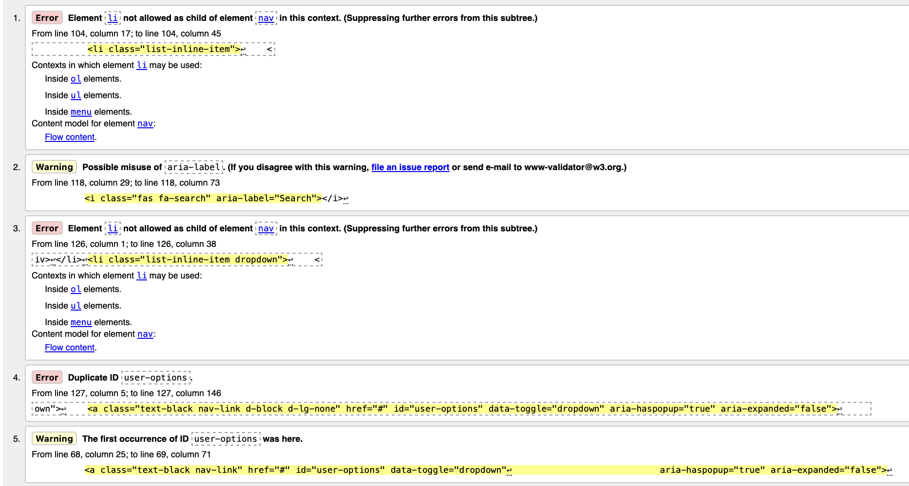
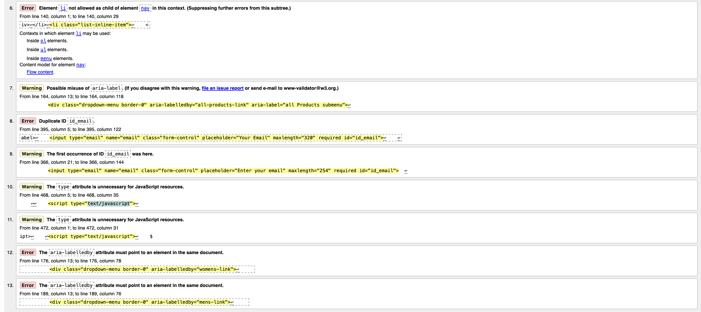
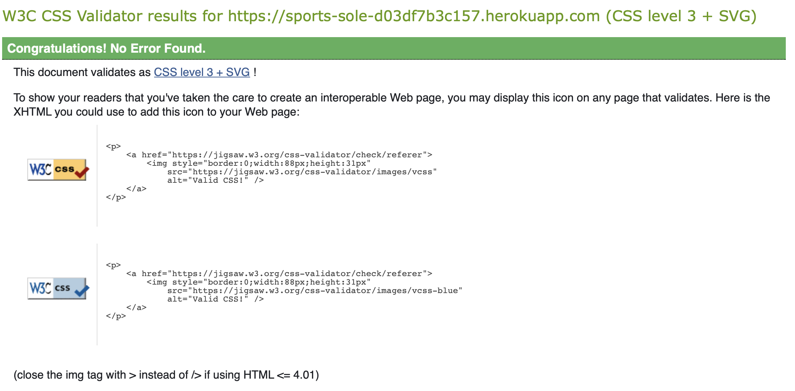

# Sports Therapy Website Testing

[Back to the README.md file](https://github.com/Alvor1991/PP4-SportsTherapy)  

[View the live website here](https://pp4-physio-4e914098e1ff.herokuapp.com)  

## Table of Contents

1. [Testing User Stories](#testing-user-stories)
2. [Code Validation](#code-validation)
3. [Accessibility](#accessibility)
4. [Tools Testing](#tools-testing)
5. [Manual Testing](#manual-testing)

***

## Testing User Stories

### 1. View a List of Sneakers
* AC1: User can see a list of sneakers on the main products page.
* AC2: Sneakers are displayed with basic information (name, image, price).
* AC3: User can navigate through multiple pages of sneakers if applicable.

### 2. See Detailed Information for Sneakers
* AC1: User can click on a sneaker to view its detailed information.
* AC2: Detailed view shows price, description, rating, and available sizes.
* AC3: User can see sneaker images clearly.

### 3. Quickly Identify Deals and Discounts
* AC1: Special offers are clearly marked on the product list.
* AC2: User can easily navigate to a dedicated special offers section.
* AC3: Discounts or deal prices are prominently displayed.

### 4. View the Total Cost of Selected Items
* AC1: Running total is visible in the shopping bag icon.
* AC2: Total updates immediately when adding or removing items.
* AC3: User can view a detailed breakdown in the shopping bag.

### 5. Register for an Account
* AC1: User can access a registration form from the main navigation.
* AC2: Form validates input and creates account with valid information.
* AC3: User receives confirmation of successful registration.

### 6. Log In or Log Out of My Account
* AC1: Registered user can log in with correct credentials.
* AC2: Logged-in user can easily log out from any page.
* AC3: User's login status is clearly indicated in the navigation.

### 7. Recover My Password
* AC1: User can request password reset from login page.
* AC2: Reset instructions are sent to user's email.
* AC3: User can set a new password and access their account.

### 8. Receive an Email Confirmation After Registering
* AC1: User receives an email shortly after registration.
* AC2: Email contains confirmation link or welcome message.
* AC3: User can verify their email address if required.

### 9. Have a Personalized User Profile
* AC1: Logged-in user can access their profile page.
* AC2: Profile displays order history and saved information.
* AC3: User can update their default delivery information.

### 10. Sort Sneakers by Price, Rating, or Category
* AC1: User can sort sneakers by price (low to high, high to low).
* AC2: User can sort sneakers by rating.
* AC3: User can sort sneakers by category.

### 11. Sort Sneakers by Category
* AC1: User can navigate to a specific sneaker category.
* AC2: Sorting options are available within the category view.
* AC3: Category-specific sorting (if applicable) is available.

### 12. Search for Sneakers by Name or Description
* AC1: Search bar is easily accessible from all pages.
* AC2: Search returns relevant results based on sneaker name or description.
* AC3: User can view the number of search results.

### 13. Filter Products Across Multiple Categories
* AC1: User can select multiple categories to filter sneakers.
* AC2: Filtered results show sneakers from all selected categories.
* AC3: User can easily add or remove categories from the filter.

### 14. Select Size and Quantity of Sneakers
* AC1: Size options are clearly displayed on the product page.
* AC2: Quantity can be easily adjusted before adding to bag.
* AC3: Selected size and quantity are confirmed when adding to bag.

### 15. View Final Cost Including Taxes and Shipping
* AC1: Final cost breakdown is shown before completing purchase.
* AC2: Taxes and shipping costs are clearly itemized.
* AC3: User can see how costs change based on delivery options.

### 16. Complete My Purchase Securely
* AC1: Checkout process guides user through payment steps.
* AC2: Payment form is clear and easy to fill out.
* AC3: User receives clear confirmation of successful purchase.

### 17. Newsletter Signup
* AC1: Newsletter signup form is easily accessible.
* AC2: User can enter email and subscribe with one click.
* AC3: Confirmation of subscription is provided to the user.

### 18. Add Product
* AC1: Admin can access a form to add new products.
* AC2: All necessary product details can be entered.
* AC3: New product appears in the product list after adding.

### 19. Edit/Update Product

* AC1: Admin can select a product to edit.
* AC2: Edit form is pre-filled with current product information.
* AC3: Changes are reflected immediately after updating.

### 20. Delete Product

* AC1: Admin can select a product to delete.
* AC2: Confirmation is required before deletion.
* AC3: Product is removed from the site after confirmation.

### 21. Client Testimonial Management

* AC1: Admin can add new client testimonials.
* AC2: Existing testimonials can be edited or removed.
* AC3: Testimonials are displayed on the appropriate page(s).

### 22. FAQ Management

* AC1: Admin can add new FAQ entries.
* AC2: Existing FAQs can be updated or deleted.
* AC3: FAQs are organized and easily accessible to users.

### 23. Contact Form

* AC1: Users can easily find and access the contact form.
* AC2: Form includes fields for name, email, and message.
* AC3: User receives confirmation when message is sent successfully.

### 24. Wishlist/Favorites Feature

* AC1: Given I am viewing a product, I can click a button to add it to my wishlist.
* AC2: When I access my profile, I can view all my wishlist items in a dedicated section.
* AC3: Given I am viewing my wishlist in my profile, I can remove items using a button beneath each product.

### 25. Post-Purchase Product Review System

* AC1: Given I have received my order, I receive an email invitation to review my purchased items.
* AC2: When clicking the review link in the email, I can rate the product and write my review.
* AC3: When viewing products, I can see verified purchase reviews from other customers to help inform my decision.

## Code Validation

### HTML

[W3C Markup Validator](https://validator.w3.org/) service was used to validate the HTML code and found the following errors:

    
    

| Warning/Error | Fix |
|--------------|-----|
| The type attribute is unnecessary for JavaScript resources. | Removed type="text/javascript" from all script tags (HTML5 default). |
| The aria-labelledby attribute must point to an element in the same document. | Updated the id of Women's to "womens-link" and Men's to "mens-link" to match aria-labelledby. |
| Possible misuse of aria-label. | Removed aria-label from dropdowns since aria-labelledby already handles accessibility. |
| The first occurrence of ID user-options was here. | Renamed the duplicate id="user-options" to id="user-options-mobile" in the mobile navigation. |
| Possible misuse of aria-label. | Removed aria-label="Search" from "fas fa-search" as it is unnecessary for purely decorative icons. |
| Element li not allowed as child of element nav in this context. | Wrapped `<li>` elements in `<ul class="list-inline">` within nav element. |
| Duplicate ID `id_email` found. | Changed duplicate IDs to unique values `id_email_signup` and `id_email_add` using django-widget-tweaks. |

### CSS

[W3C CSS Validator](https://jigsaw.w3.org/css-validator/) service was used to validate the CSS code of the project to ensure there were no syntax errors.

W3C CSS Validator found no errors or warnings in the CSS.

### Python

[PEP8CI](https://pep8ci.herokuapp.com/) was used to validate the Python code for PEP8 compliance. As there were many files to assess within each app, I have focused on the appointment app for this testing section. 

| Location | Errors / Warnings | Code Reviewed |
| --- | --- | --- |
| ./appointments/model.py |  |  |
| ./appointments/views.py |  |  |
| ./appointments/forms.py |  |  |

### JavaScript

[JSHint's JavaScript Code Quality Tool](https://jshint.com/) was used to validate the site's JavaScript code.

During development, I encountered errors related to the use of ES6 features, such as const, arrow functions, and template literals, which were flagged by environments expecting older JavaScript versions.

Despite these errors, I chose to stick with ES6 as it offers a more modern and readable syntax, improving code maintainability. The project targets modern browsers, which fully support ES6, allowing for better performance & alignment with current web development practices.

## Accessibility

Lighthouse in Chrome DevTools was used to confirm that colors & fonts used throughout the website are easy to read and accessible.

### Lighthouse Reports

Page | Lighthouse Report |
| --- | --- |
| Home |  |
| About |  |
| Treatments |  |
| My appointments |  |
| Login |  |
| Signup |  |

## Tools Testing

### Responsiveness

* Chrome DevTools was used to test responsiveness in different screen sizes during the development process.

## Manual Testing

### Browser Compatibility

Browser | Outcome | Pass/Fail | 
--- | --- | --- |
Google Chrome | No appearance, responsiveness, or functionality issues.| Pass |
Safari | No appearance, responsiveness, or functionality issues. | Pass |
Mozilla Firefox | No responsiveness or functionality issues.| Pass |

### Device Compatibility

Device | Operating System | Outcome | Pass/Fail
--- | --- | --- | --- |
MacBook Air 15" | macOS Sonoma | No appearance, responsiveness, or functionality issues. | Pass |
iPhone SE | iOS 15 | No appearance, responsiveness, or functionality issues. | Pass |

### Test Results

### Login Page Testing

| Feature                  | Users | Test                               | Outcome                                   | Pass/Fail |
|--------------------------|-------|------------------------------------|-------------------------------------------|-----------|
| Login Form               | All   | Form Input                         | Accepts valid username/email and password | Pass |
|                          |       | Submit Button                      | Logs user in with correct credentials     | Pass |
| Additional Links         | All   | Forgot Password Link               | Links to password reset page               | Pass |
|                          |       | Register Link                      | Links to registration page                 | Pass |

---

### Registration Page Testing

| Feature                   | Users     | Test                               | Outcome                                   | Pass/Fail |
|---------------------------|-----------|------------------------------------|-------------------------------------------|-----------|
| Registration Form         | All       | Form Fields                        | All required fields validate correctly     | Pass |
|                           |           | Password Validation                | Ensures passwords match and meet requirements | Pass |
|                           |           | Submit Button                     | Creates account and sends verification email | Pass |
| Additional Features       | All       | Email Verification                 | Verification email sent and link works correctly | Pass |
|                           |           | Login Link                        | Links to login page for existing users     | Pass |

#### Base HTML 

#### Base Features

<table>
    <tr>
        <th colspan=2>Feature</th>
        <th>Users</th>
        <th>Test</th>
        <th>Outcome</th>
        <th>Pass/Fail</th>
    </tr>
    <tr>
        <td rowspan=5>Navigation Bar</td>
        <td rowspan=1>Sports Sole logo</td>
        <td rowspan=1>All</td>
        <td>Functionality</td>
        <td>Clicking the logo redirects to the Home page</td>
        <td>Pass</td>
    </tr>
    <tr>
        <td rowspan=1>Search Bar</td>
        <td rowspan=1>All</td>
        <td>Functionality</td>
        <td>Search input works and returns relevant results</td>
        <td>Pass</td>
    </tr>
    <tr>
        <td rowspan=1>My Account Dropdown</td>
        <td rowspan=1>All</td>
        <td>Functionality</td>
        <td>Dropdown menu shows appropriate options for logged in/out users</td>
        <td>Pass</td>
    </tr>
    <tr>
        <td rowspan=1>Shopping Bag</td>
        <td rowspan=1>All</td>
        <td>Functionality</td>
        <td>Shows correct total and links to shopping bag page</td>
        <td>Pass</td>
    </tr>
    <tr>
        <td rowspan=1>Main Nav Menu</td>
        <td rowspan=1>All</td>
        <td>Functionality</td>
        <td>All navigation links work correctly</td>
        <td>Pass</td>
    </tr>
</table>

#### Home Page

<table>
    <tr>
        <th colspan=2>Feature</th>
        <th>Users</th>
        <th>Test</th>
        <th>Outcome</th>
        <th>Pass/Fail</th>
    </tr>
    <tr>
        <td rowspan=2>Hero Section</td>
        <td rowspan=1>Shop Now button</td>
        <td rowspan=1>All</td>
        <td>Functionality</td>
        <td>Redirects to products page when clicked</td>
        <td>Pass</td>
    </tr>
    <tr>
        <td rowspan=1>Hero Image</td>
        <td rowspan=1>All</td>
        <td>Functionality</td>
        <td>Image loads correctly</td>
        <td>Pass</td>
    </tr>
    <tr>
        <td rowspan=1>New Arrivals</td>
        <td rowspan=1>Product Cards</td>
        <td rowspan=1>All</td>
        <td>Functionality</td>
        <td>Links to correct product details pages</td>
        <td>Pass</td>
    </tr>
</table>

#### Products Page

<table>
    <tr>
        <th colspan=2>Feature</th>
        <th>Users</th>
        <th>Test</th>
        <th>Outcome</th>
        <th>Pass/Fail</th>
    </tr>
    <tr>
        <td rowspan=3>Product Filters</td>
        <td rowspan=1>Category Filtering</td>
        <td rowspan=1>All</td>
        <td>Functionality</td>
        <td>Filters products by selected category</td>
        <td>Pass</td>
    </tr>
    <tr>
        <td rowspan=1>Sort Selector</td>
        <td rowspan=1>All</td>
        <td>Functionality</td>
        <td>Sorts products by price, rating, name as selected</td>
        <td>Pass</td>
    </tr>
    <tr>
        <td rowspan=1>Price Filtering</td>
        <td rowspan=1>All</td>
        <td>Functionality</td>
        <td>Filters products within selected price range</td>
        <td>Pass</td>
    </tr>
    <tr>
        <td rowspan=2>Product Cards</td>
        <td rowspan=1>Product Information</td>
        <td rowspan=1>All</td>
        <td>Functionality</td>
        <td>Displays correct product details and links to product page</td>
        <td>Pass</td>
    </tr>
    <tr>
        <td rowspan=1>Edit/Delete Links</td>
        <td rowspan=1>Admin</td>
        <td>Functionality</td>
        <td>Edit and delete options visible only to admin</td>
        <td>Pass</td>
    </tr>
</table>

#### Product Detail Page

<table>
    <tr>
        <th colspan=2>Feature</th>
        <th>Users</th>
        <th>Test</th>
        <th>Outcome</th>
        <th>Pass/Fail</th>
    </tr>
    <tr>
        <td rowspan=2>Product Images</td>
        <td rowspan=1>Main Image</td>
        <td rowspan=1>All</td>
        <td>Functionality</td>
        <td>Image loads correctly</td>
        <td>Pass</td>
    </tr>
    <tr>
        <td rowspan=1>Additional Images</td>
        <td rowspan=1>All</td>
        <td>Functionality</td>
        <td>Additional product images load and display correctly</td>
        <td>Pass</td>
    </tr>
    <tr>
        <td rowspan=3>Product Controls</td>
        <td rowspan=1>Size Selector</td>
        <td rowspan=1>All</td>
        <td>Functionality</td>
        <td>Size selection works correctly</td>
        <td>Pass</td>
    </tr>
    <tr>
        <td rowspan=1>Quantity Selector</td>
        <td rowspan=1>All</td>
        <td>Functionality</td>
        <td>Quantity can be adjusted within valid range</td>
        <td>Pass</td>
    </tr>
    <tr>
        <td rowspan=1>Add to Bag Button</td>
        <td rowspan=1>All</td>
        <td>Functionality</td>
        <td>Adds selected product to shopping bag</td>
        <td>Pass</td>
    </tr>
    <tr>
        <td rowspan=1>Keep Shopping</td>
        <td rowspan=1>Return Link</td>
        <td rowspan=1>All</td>
        <td>Functionality</td>
        <td>Returns to products page</td>
        <td>Pass</td>
    </tr>
</table>

#### Profile Page

<table>
    <tr>
        <th colspan=2>Feature</th>
        <th>Users</th>
        <th>Test</th>
        <th>Outcome</th>
        <th>Pass/Fail</th>
    </tr>
    <tr>
        <td rowspan=3>Default Delivery Information</td>
        <td rowspan=1>Form Fields</td>
        <td rowspan=1>Registered</td>
        <td>Functionality</td>
        <td>All fields can be updated and saved correctly</td>
        <td>Pass</td>
    </tr>
    <tr>
        <td rowspan=1>Update Button</td>
        <td rowspan=1>Registered</td>
        <td>Functionality</td>
        <td>Successfully updates delivery information</td>
        <td>Pass</td>
    </tr>
    <tr>
        <td rowspan=1>Country Selector</td>
        <td rowspan=1>Registered</td>
        <td>Functionality</td>
        <td>Shows and selects countries correctly</td>
        <td>Pass</td>
    </tr>
    <tr>
        <td rowspan=4>Order History</td>
        <td rowspan=1>Order List</td>
        <td rowspan=1>Registered</td>
        <td>Functionality</td>
        <td>Shows all past orders with correct details</td>
        <td>Pass</td>
    </tr>
    <tr>
        <td rowspan=1>Order Details Link</td>
        <td rowspan=1>Registered</td>
        <td>Functionality</td>
        <td>Links to detailed view of past orders</td>
        <td>Pass</td>
    </tr>
    <tr>
        <td rowspan=1>Order Number</td>
        <td rowspan=1>Registered</td>
        <td>Functionality</td>
        <td>Shows truncated order number with full number on hover</td>
        <td>Pass</td>
    </tr>
    <tr>
        <td rowspan=1>Order Information</td>
        <td rowspan=1>Registered</td>
        <td>Functionality</td>
        <td>Displays correct date, items, and total for each order</td>
        <td>Pass</td>
    </tr>
    <tr>
        <td rowspan=2>Success Messages</td>
        <td rowspan=1>Update Success</td>
        <td rowspan=1>Registered</td>
        <td>Functionality</td>
        <td>Shows confirmation when profile is updated</td>
        <td>Pass</td>
    </tr>
    <tr>
        <td rowspan=1>Toast Messages</td>
        <td rowspan=1>Registered</td>
        <td>Functionality</td>
        <td>Shows relevant toast messages for actions</td>
        <td>Pass</td>
    </tr>
</table>

#### Newsletter Management

<table>
    <tr>
        <th colspan=2>Feature</th>
        <th>Users</th>
        <th>Test</th>
        <th>Outcome</th>
        <th>Pass/Fail</th>
    </tr>
    <tr>
        <td rowspan=3>Newsletter Signup</td>
        <td rowspan=1>Email Input</td>
        <td rowspan=1>All</td>
        <td>Functionality</td>
        <td>Validates email format and prevents duplicates</td>
        <td>Pass</td>
    </tr>
    <tr>
        <td rowspan=1>Submit Button</td>
        <td rowspan=1>All</td>
        <td>Functionality</td>
        <td>Successfully subscribes user to newsletter</td>
        <td>Pass</td>
    </tr>
    <tr>
        <td rowspan=1>Success Message</td>
        <td rowspan=1>All</td>
        <td>Functionality</td>
        <td>Displays confirmation of successful signup</td>
        <td>Pass</td>
    </tr>
</table>

#### Testimonials Management

<table>
    <tr>
        <th colspan=2>Feature</th>
        <th>Users</th>
        <th>Test</th>
        <th>Outcome</th>
        <th>Pass/Fail</th>
    </tr>
    <tr>
        <td rowspan=4>Display Testimonials</td>
        <td rowspan=1>Testimonial Cards</td>
        <td rowspan=1>All</td>
        <td>Functionality</td>
        <td>Displays all approved testimonials</td>
        <td>Pass</td>
    </tr>
    <tr>
        <td rowspan=1>Rating Display</td>
        <td rowspan=1>All</td>
        <td>Functionality</td>
        <td>Shows correct star rating for each testimonial</td>
        <td>Pass</td>
    </tr>
    <tr>
        <td rowspan=1>Testimonial Text</td>
        <td rowspan=1>All</td>
        <td>Functionality</td>
        <td>Displays full testimonial text correctly</td>
        <td>Pass</td>
    </tr>
    <tr>
        <td rowspan=1>Customer Name</td>
        <td rowspan=1>All</td>
        <td>Functionality</td>
        <td>Shows customer name correctly</td>
        <td>Pass</td>
    </tr>
    <tr>
        <td rowspan=3>Admin Controls</td>
        <td rowspan=1>Add Testimonial</td>
        <td rowspan=1>Admin</td>
        <td>Functionality</td>
        <td>Successfully adds new testimonials</td>
        <td>Pass</td>
    </tr>
    <tr>
        <td rowspan=1>Edit Testimonial</td>
        <td rowspan=1>Admin</td>
        <td>Functionality</td>
        <td>Successfully edits existing testimonials</td>
        <td>Pass</td>
    </tr>
    <tr>
        <td rowspan=1>Delete Testimonial</td>
        <td rowspan=1>Admin</td>
        <td>Functionality</td>
        <td>Successfully removes testimonials</td>
        <td>Pass</td>
    </tr>
</table>

#### FAQ Management

<table>
    <tr>
        <th colspan=2>Feature</th>
        <th>Users</th>
        <th>Test</th>
        <th>Outcome</th>
        <th>Pass/Fail</th>
    </tr>
    <tr>
        <td rowspan=3>Display FAQs</td>
        <td rowspan=1>FAQ List</td>
        <td rowspan=1>All</td>
        <td>Functionality</td>
        <td>Shows all FAQ items in correct order</td>
        <td>Pass</td>
    </tr>
    <tr>
        <td rowspan=1>Accordion Function</td>
        <td rowspan=1>All</td>
        <td>Functionality</td>
        <td>Expands/collapses FAQ answers correctly</td>
        <td>Pass</td>
    </tr>
    <tr>
        <td rowspan=1>Category Display</td>
        <td rowspan=1>All</td>
        <td>Functionality</td>
        <td>Groups FAQs by category correctly</td>
        <td>Pass</td>
    </tr>
    <tr>
        <td rowspan=3>Admin Controls</td>
        <td rowspan=1>Add FAQ</td>
        <td rowspan=1>Admin</td>
        <td>Functionality</td>
        <td>Successfully adds new FAQ items</td>
        <td>Pass</td>
    </tr>
    <tr>
        <td rowspan=1>Edit FAQ</td>
        <td rowspan=1>Admin</td>
        <td>Functionality</td>
        <td>Successfully edits existing FAQs</td>
        <td>Pass</td>
    </tr>
    <tr>
        <td rowspan=1>Delete FAQ</td>
        <td rowspan=1>Admin</td>
        <td>Functionality</td>
        <td>Successfully removes FAQ items</td>
        <td>Pass</td>
    </tr>
</table>

#### Contact Form

<table>
    <tr>
        <th colspan=2>Feature</th>
        <th>Users</th>
        <th>Test</th>
        <th>Outcome</th>
        <th>Pass/Fail</th>
    </tr>
    <tr>
        <td rowspan=4>Form Fields</td>
        <td rowspan=1>Name Field</td>
        <td rowspan=1>All</td>
        <td>Functionality</td>
        <td>Validates and requires name input</td>
        <td>Pass</td>
    </tr>
    <tr>
        <td rowspan=1>Email Field</td>
        <td rowspan=1>All</td>
        <td>Functionality</td>
        <td>Validates email format correctly</td>
        <td>Pass</td>
    </tr>
    <tr>
        <td rowspan=1>Message Field</td>
        <td rowspan=1>All</td>
        <td>Functionality</td>
        <td>Accepts and requires message input</td>
        <td>Pass</td>
    </tr>
    <tr>
        <td rowspan=1>Submit Button</td>
        <td rowspan=1>All</td>
        <td>Functionality</td>
        <td>Successfully submits form when valid</td>
        <td>Pass</td>
    </tr>
    <tr>
        <td rowspan=2>Form Feedback</td>
        <td rowspan=1>Success Message</td>
        <td rowspan=1>All</td>
        <td>Functionality</td>
        <td>Shows success message after submission</td>
        <td>Pass</td>
    </tr>
    <tr>
        <td rowspan=1>Error Messages</td>
        <td rowspan=1>All</td>
        <td>Functionality</td>
        <td>Shows appropriate error messages for invalid inputs</td>
        <td>Pass</td>
    </tr>
</table>

#### Toast Messages

<table>
    <tr>
        <th colspan=2>Feature</th>
        <th>Users</th>
        <th>Test</th>
        <th>Outcome</th>
        <th>Pass/Fail</th>
    </tr>
    <tr>
        <td rowspan=4>Success Toasts</td>
        <td rowspan=1>Add to Bag</td>
        <td rowspan=1>All</td>
        <td>Functionality</td>
        <td>Shows when item added to bag</td>
        <td>Pass</td>
    </tr>
    <tr>
        <td rowspan=1>Profile Update</td>
        <td rowspan=1>Registered</td>
        <td>Functionality</td>
        <td>Shows when profile updated</td>
        <td>Pass</td>
    </tr>
    <tr>
        <td rowspan=1>Order Confirmation</td>
        <td rowspan=1>All</td>
        <td>Functionality</td>
        <td>Shows after successful order</td>
        <td>Pass</td>
    </tr>
    <tr>
        <td rowspan=1>Sign In/Out</td>
        <td rowspan=1>Registered</td>
        <td>Functionality</td>
        <td>Shows on successful login/logout</td>
        <td>Pass</td>
    </tr>
    <tr>
        <td rowspan=2>Error Toasts</td>
        <td rowspan=1>Form Errors</td>
        <td rowspan=1>All</td>
        <td>Functionality</td>
        <td>Shows when form submission fails</td>
        <td>Pass</td>
    </tr>
    <tr>
        <td rowspan=1>Payment Errors</td>
        <td rowspan=1>All</td>
        <td>Functionality</td>
        <td>Shows when payment fails</td>
        <td>Pass</td>
    </tr>
</table>

#### General Site Navigation

<table>
    <tr>
        <th colspan=2>Feature</th>
        <th>Users</th>
        <th>Test</th>
        <th>Outcome</th>
        <th>Pass/Fail</th>
    </tr>
    <tr>
        <td rowspan=3>Header Consistency</td>
        <td rowspan=1>Navigation Bar</td>
        <td rowspan=1>All</td>
        <td>Functionality</td>
        <td>Remains fixed at top across all pages</td>
        <td>Pass</td>
    </tr>
    <tr>
        <td rowspan=1>Search Function</td>
        <td rowspan=1>All</td>
        <td>Functionality</td>
        <td>Available and functional on all pages</td>
        <td>Pass</td>
    </tr>
    <tr>
        <td rowspan=1>Shopping Bag Icon</td>
        <td rowspan=1>All</td>
        <td>Functionality</td>
        <td>Updates and accessible from all pages</td>
        <td>Pass</td>
    </tr>
    <tr>
        <td rowspan=3>Footer Consistency</td>
        <td rowspan=1>Footer Content</td>
        <td rowspan=1>All</td>
        <td>Functionality</td>
        <td>All links functional across pages</td>
        <td>Pass</td>
    </tr>
    <tr>
        <td rowspan=1>Newsletter Signup</td>
        <td rowspan=1>All</td>
        <td>Functionality</td>
        <td>Form accessible from all pages</td>
        <td>Pass</td>
    </tr>
    <tr>
        <td rowspan=1>Social Links</td>
        <td rowspan=1>All</td>
        <td>Functionality</td>
        <td>All social links work correctly</td>
        <td>Pass</td>
    </tr>
</table>

#### Responsive Design Testing

<table>
    <tr>
        <th colspan=2>Feature</th>
        <th>Device/Screen Size</th>
        <th>Test</th>
        <th>Outcome</th>
        <th>Pass/Fail</th>
    </tr>
    <tr>
        <td rowspan=4>Navigation Elements</td>
        <td rowspan=1>Desktop (>1024px)</td>
        <td rowspan=1>Large Screens</td>
        <td>Functionality</td>
        <td>All navigation elements accessible</td>
        <td>Pass</td>
    </tr>
    <tr>
        <td rowspan=1>Tablet (768px-1024px)</td>
        <td rowspan=1>Medium Screens</td>
        <td>Functionality</td>
        <td>All features remain accessible</td>
        <td>Pass</td>
    </tr>
    <tr>
        <td rowspan=1>Mobile (320px-767px)</td>
        <td rowspan=1>Small Screens</td>
        <td>Functionality</td>
        <td>Menu toggles correctly, all links work</td>
        <td>Pass</td>
    </tr>
    <tr>
        <td rowspan=1>Small Mobile (<320px)</td>
        <td rowspan=1>Extra Small</td>
        <td>Functionality</td>
        <td>All essential features usable</td>
        <td>Pass</td>
    </tr>
    <tr>
        <td rowspan=4>Content Layout</td>
        <td rowspan=1>Product Cards</td>
        <td rowspan=1>All Sizes</td>
        <td>Functionality</td>
        <td>All product information remains visible</td>
        <td>Pass</td>
    </tr>
    <tr>
        <td rowspan=1>Forms</td>
        <td rowspan=1>All Sizes</td>
        <td>Functionality</td>
        <td>All form fields remain usable</td>
        <td>Pass</td>
    </tr>
    <tr>
        <td rowspan=1>Images</td>
        <td rowspan=1>All Sizes</td>
        <td>Functionality</td>
        <td>Images load and display correctly</td>
        <td>Pass</td>
    </tr>
    <tr>
        <td rowspan=1>Text Content</td>
        <td rowspan=1>All Sizes</td>
        <td>Functionality</td>
        <td>No text overflow or overlap issues</td>
        <td>Pass</td>
    </tr>
</table>

#### Wishlist Feature

<table>
   <tr>
       <th colspan=2>Feature</th>
       <th>Users</th>
       <th>Test</th>
       <th>Outcome</th>
       <th>Pass/Fail</th>
   </tr>
   <tr>
       <td rowspan=3>Add to Wishlist Button</td>
       <td rowspan=1>Non-Logged In Users</td>
       <td rowspan=1>All</td>
       <td>Functionality</td>
       <td>Prompts user to sign in when clicked</td>
       <td>Pass</td>
   </tr>
   <tr>
       <td rowspan=1>Logged In Users</td>
       <td rowspan=1>Registered</td>
       <td>Functionality</td>
       <td>Successfully adds item to wishlist</td>
       <td>Pass</td>
   </tr>
   <tr>
       <td rowspan=1>Button Position</td>
       <td rowspan=1>All</td>
       <td>Functionality</td>
       <td>Consistent location on all product detail pages</td>
       <td>Pass</td>
   </tr>
   <tr>
       <td rowspan=3>Toast Notifications</td>
       <td rowspan=1>Success Message</td>
       <td rowspan=1>Registered</td>
       <td>Functionality</td>
       <td>Shows when item successfully added to wishlist</td>
       <td>Pass</td>
   </tr>
   <tr>
       <td rowspan=1>Duplicate Item Alert</td>
       <td rowspan=1>Registered</td>
       <td>Functionality</td>
       <td>Alert when attempting to add existing item</td>
       <td>Pass</td>
   </tr>
   <tr>
       <td rowspan=1>View Wishlist Button</td>
       <td rowspan=1>Registered</td>
       <td>Functionality</td>
       <td>Button in toast redirects to wishlist</td>
       <td>Pass</td>
   </tr>
   <tr>
       <td rowspan=4>Wishlist Display</td>
       <td rowspan=1>Profile Integration</td>
       <td rowspan=1>Registered</td>
       <td>Functionality</td>
       <td>Wishlist accessible from profile page</td>
       <td>Pass</td>
   </tr>
   <tr>
       <td rowspan=1>Item Display</td>
       <td rowspan=1>Registered</td>
       <td>Functionality</td>
       <td>Shows all wishlisted items correctly</td>
       <td>Pass</td>
   </tr>
   <tr>
       <td rowspan=1>Remove Items</td>
       <td rowspan=1>Registered</td>
       <td>Functionality</td>
       <td>Can remove items from wishlist</td>
       <td>Pass</td>
   </tr>
   <tr>
       <td rowspan=1>Empty State</td>
       <td rowspan=1>Registered</td>
       <td>Functionality</td>
       <td>Shows appropriate message when wishlist empty</td>
       <td>Pass</td>
   </tr>
</table>